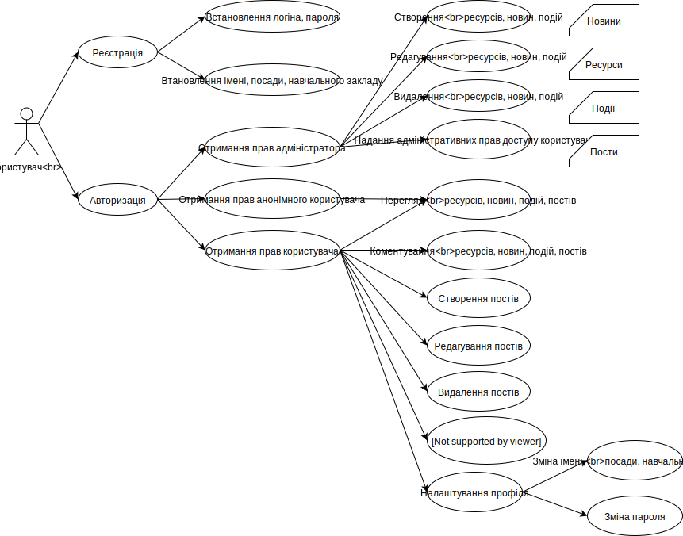

# Функціональні вимоги

# Нефункціональні вимоги

### Готовність інтерфейсу - формальне

- Виконано всі пункти функціональних вимог до цього інтерфейсу.
- В інтерфейсі враховані побажання з аналізу інтерфейсних рішень.
- Інтерфейс і всі його елементи протестовані вручну в реальному сценарії використання.
- У всіх інтерфейсах дотримуються принципи консистентності (сталість елементів) в зовнішньому вигляді і поведінці.
- Тривале використання інтерфейсу без перезавантаження не повинно призводити до витоку пам'яті.
- Інтерфейс не дозволяє користувачеві потрапити в пастку - такий стан, з якого не можна вийти стандартними засобами інтерфейсу.

### Готовність інтерфейсу - загальне

- Інтерфейс відображається і коректно працює у всіх сучасних браузерах (Google Chrome 50.0+, Mozilla Firefox 49.0+, Internet Explorer 10.0+, Opera 41.0.2353+, Microsoft Edge 33.0+, Safari 10.1.2).
- В інтерфейсі передбачені механізми річ-інтерфейсу: будь-які зміни користувач повинен мати можливість побачити не перевантажуючи інтерфейс кнопкою F5.
- Статика має кешуватися дли прискорення завантаження сайту.
- Інтерфейс відображається і коректно працює на мобільних пристроях на iOS 10.0.1+ і Android 5.1.х+.
- Всі картинки добре відображаються на retina-екранах.
- Написи не містять помилок і орфографічних помилок.
- Все відображаються суми і попередні розрахунки відповідають реальності і фізичним змістом.
- Вибрані фільтри після відходу з інтерфейсу зберігаються крім спеціально обумовлених місць.
- У всіх заголовках застосовано правило капіталізації кожного слова: Sign in -> Sign In.

### Форматування відображуваних даних

- Сітка розташування елементів не руйнується при використанні реальних і граничних (довгих або коротких) даних.
- Коректно відображаються порожні значення нулями або прочерками в залежності від типу вмісту.
- Всі отримані значення від бекенд форматируются для коректного відображення (кількість знаків після точки, максимальна довжина і т.д.).
- Все відображаються суми коректно відформатовані за загальним стандартом.
- Форма після відправки форми або відходу з інтерфейсу очищається крім спеціально обумовлених місць.
- Для всіх інпут вказані відповідні типи, щоб на мобільних пристроях відкривалася відповідна клавіатура.
- Всі форми повинні підтримувати заповнення з клавіатури (коректний перехід по табуляції і т.д.)
- Лейбли інпут починаються з великої літери і не містять двокрапки в кінці.

### Асинхронні дії

- Будь-яка дія, що вимагає запиту до сервера, відображає індикатор активності на час, поки не буде готовий відповідь або повідомлення про помилку.
- Будь-яка дія, що вимагає запиту до сервера, блокує елемент управління (кнопку) від повторних натискань на час, поки відображається індикатор активності.
- Між змінами станів: "початкове -> відображається індикатор -> відображається результат" не повинно бути затримок, під час яких відображається невизначений проміжний стан.

### Таблиці

- Протестовані і працюють всі фільтри.
- У таблицях встановлено зрозуміле сортування за замовчуванням.
- Таблиці забезпечені швидкої сортуванням там де це корисно.
- Всі елементи і колонки в таблицях вирівняні логічним (зрозумілою) чином.
- Дані не повинні пропадати на час поновлення їх з сервера.
- Первісна завантаження даних в таблицю повинна супроводжуватися написом Data is loading.
- Оновлення REST-запитом раніше завантажених даних супроводжується Блур таблиці і спиннер-трикрапкою поверх нього.
- Оновлення раніше завантажених даних по сокету завершується підсвічуванням змінених значень.
- Якщо після первинного завантаження або оновлення даних в таблиці не виявляється даних для відображення, повинна з'явитися напис Nothing to show here під заголовної рядком таблиці.
- В поле швидкого пошуку вказано по якому полю воно шукає.

### Повідомлення валідації

- Повідомлення валідації розташовані поруч з відповідними полями введення.
- Повідомлення валідації оформлені ідентично незалежно від джерела їх походження: серверної валідації або клієнтської.
- Ні в якому разі не виводиться нативная браузерна валідація введення.
- Текст повідомлення про помилку валідації точно описує причину спрацювання валідації.
- Валідація на клієнті не містить логіки за винятком перевірки заповнення обов'язкового поля і явних помилок введення (наприклад, email без символу @).
- Повідомлення валідації очищаються після відправки форми або відходу з поточного екрану.

### Візуальні деталі

- Елементи не злипаються один з одним.
- Дотримується правило близькості: два не зв'язаних елемента повинні розташовуватися далі один від одного, ніж два пов'язаних.
- Розташування елементів, що повторюються в різних місцях зберігається щодо сусідніх елементів і екрану в цілому.
- Елементи, на які можна натиснути, повинні відрізнятися від елементів, на які не можна натиснути, не тільки при наведенні.
- Всі елементи, на які можна натиснути, підсвічуються при наведенні незалежно від знаходження фокусу і курсор на них змінюється на руку.
- Елементи, на які не можна натиснути, не підсвічуються при наведенні і не змінюють курсор на руку.

### Обробка помилок

- Якщо при будь-якій дії користувача сталося щось, що завадило виконати дію, має відобразитися зрозуміле повідомлення про помилку стандартним чином.
- Якщо відбулася глобальна помилка запуску інтерфейсу, відображається зрозуміле повідомлення про помилку.
- Якщо дія вимагає запиту до сервера не завершилося через помилки, інтерфейс не залишається заблокованим (вічний індикатор прогресу, заблокована кнопка і т.д.)
- Якщо в браузері користувача відключені cookie, javascript і т.д. він повинен отримати зрозуміле повідомлення про це замість зламаного інтерфейсу.

### Модальні вікна

- У модальному вікні немає хрестика для закриття.
- Модальне вікно закривається при натисканні поза області вікна.
- Головні кнопки в модале підфарбовують при наведенні: Cancel червоним, Close нейтральним, корисну дію зеленим.
- Якщо в поточному стані модала користувач не може зробити щось корисне, що закриває кнопка повинна називатися Close, в іншому випадку Cancel.
- Обробка залогіненним і анонімного користувача
- Анонімний користувач не бачить елементів інтерфейсу, призначених для залогінених користувачів (виняток - форма створення заявки) і навпаки.
- Після логаута користувач не має можливість отримувати дані з облікового запису включаючи вебсокети.
